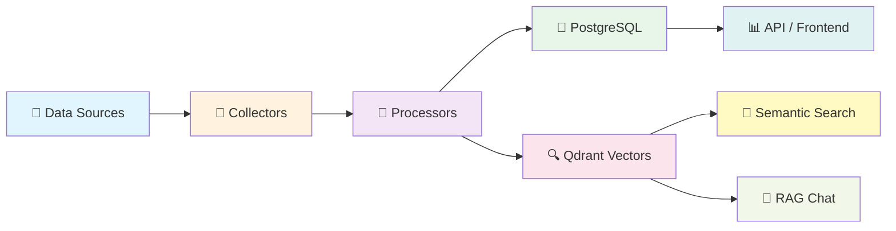

<p align="center">
  
</p>

<h1 align="center">🔬 RRI — Research & Repository Intelligence</h1>

<p align="center">
  <em>An AI-powered OSINT platform for automated research paper discovery, GitHub repository tracking, and intelligent knowledge management.</em>
</p>

<p align="center">
  <a href="#-features"></a>
  <a href="#-tech-stack"></a>
  <a href="#-tech-stack"></a>
  <a href="#-tech-stack"></a>
  <a href="#-tech-stack"></a>
  <a href="LICENSE"></a>
</p>

<p align="center">
  <a href="#-quick-start">Quick Start</a> •
  <a href="#-features">Features</a> •
  <a href="#-architecture">Architecture</a> •
  <a href="#-screenshots">Screenshots</a> •
  <a href="#-api-reference">API Reference</a> •
  <a href="#-contributing">Contributing</a>
</p>

---

## 📖 Overview

**RRI (Research & Repository Intelligence)** is a full-stack, self-hosted platform designed for researchers, engineers, and teams who want to **automate the discovery and analysis** of academic papers, open-source repositories, and AI/ML community discussions — all in one place.

RRI continuously collects data from **11+ sources**, processes it with NLP pipelines, indexes everything into a **vector database** for semantic search, and provides an **AI chat interface** (RAG) so you can ask questions about your research corpus in natural language.

### 🎯 Who is RRI for?

| Audience | Use Case |
|:---------|:---------|
| 🎓 **Researchers** | Track new papers in your field, discover related work, get AI-generated summaries |
| 👩‍💻 **ML Engineers** | Monitor trending GitHub repos, HuggingFace models, and community discussions |
| 🏢 **Research Teams** | Centralized knowledge base with document chat, bookmarks, and weekly digests |
| 📊 **Tech Leads** | Tech radar, trend analysis, and automated intelligence reports |

---

## ✨ Features

### 📄 Multi-Source Data Collection

RRI automatically collects and aggregates data from **11+ academic and developer sources**:

| Source | Type | Data Collected |
|:-------|:-----|:---------------|
| 🔬 **ArXiv** | Papers | Pre-prints with abstracts, categories, authors |
| 📚 **Semantic Scholar** | Papers | Citations, references, influence scores |
| 🌐 **OpenAlex** | Papers | Open-access metadata, concepts, institutions |
| 💻 **Papers With Code** | Papers + Code | Paper-code links, benchmarks, tasks |
| 🐙 **GitHub** | Repositories | Stars, forks, languages, topics, README |
| 🤗 **HuggingFace** | Models + Papers | Model cards, downloads, daily papers |
| 📝 **OpenReview** | Peer Reviews | ICLR/NeurIPS reviews, ratings, decisions |
| 🟠 **Hacker News** | Discussions | AI/ML posts, scores, comments |
| ✍️ **Dev.to** | Blog Posts | Technical articles, tags, reactions |
| 🐘 **Mastodon** | Social Posts | Research community discussions |
| 🔗 **Lemmy** | Forum Posts | Federated community discussions |

### 🔍 Semantic Search

- **Vector-based search** powered by [Qdrant](https://qdrant.tech/) and [BGE embeddings](https://huggingface.co/BAAI/bge-base-en-v1.5)
- Search across **papers and repositories** simultaneously
- Relevance scoring with percentage match display
- Filter results by type (Papers / Repos / All)

### 🤖 AI-Powered Chat (RAG)

- **Retrieval-Augmented Generation** pipeline with context-aware answers
- Dual LLM support: **Ollama** (local, private) + **OpenAI GPT-4o** (cloud)
- **Document Chat**: Upload PDFs, DOCX, PPTX → ask questions about your documents
- **Repo Ingestion**: Ingest entire GitHub repositories via [gitingest](https://github.com/cyclotruc/gitingest) → chat about code
- Full context mode vs. RAG retrieval mode per conversation
- Conversation history with multi-turn support

### 📊 Analytics & Trending

- **Papers Overview**: Category distribution (donut chart), yearly publication trends (bar chart)
- **Trending Papers & Repos**: Filterable by period (day/week/month), category, language
- **Tech Radar**: Auto-generated technology trend analysis
- **HuggingFace Dashboard**: Model rankings, download stats, task distribution
- **Community Keywords**: Trending topics across platforms with keyword analysis

### 📋 Knowledge Management

- **Bookmarks & Folders**: Organize papers and repos into custom folders
- **My Library**: Personal document collection with folder tree
- **Weekly Reports**: Auto-generated research digest summaries
- **Paper-Code Linking**: Automatically match papers to their implementations
- **Citation Enrichment**: Bulk update citation counts from Semantic Scholar

### 🔐 Authentication & Multi-User

- JWT-based authentication with user registration/login
- Per-user document libraries, bookmarks, and conversations
- Role-based access to AI chat features

### 🌙 Modern UI/UX

- **Dark/Light theme** toggle with smooth transitions
- **Responsive design** with glassmorphism effects and micro-animations
- **Interactive charts** built with Recharts
- **Knowledge graph** visualization with react-force-graph-2d
- Global search bar with keyboard shortcut (`/`)

---

## 🏗 Architecture

```
┌────────────────────────────────────────────────────────────────────────┐
│                           FRONTEND (Next.js 14)                        │
│  Dashboard │ Papers │ Repos │ Search │ Trending │ Community │ AI Chat  │
└──────────────────────────────┬─────────────────────────────────────────┘
                               │ REST API
┌──────────────────────────────┴─────────────────────────────────────────┐
│                          BACKEND (FastAPI)                              │
│                                                                        │
│  ┌──────────┐  ┌───────────┐  ┌─────────┐  ┌──────────┐  ┌─────────┐ │
│  │  API     │  │ Collectors│  │Processors│  │   LLM    │  │   RAG   │ │
│  │ Routers  │  │           │  │          │  │  Router  │  │Pipeline │ │
│  │ (15)     │  │ ArXiv     │  │Embedding │  │          │  │         │ │
│  │          │  │ GitHub    │  │Classifier│  │  Ollama  │  │Retriever│ │
│  │ Papers   │  │ Semantic  │  │Summarizer│  │  OpenAI  │  │Reranker │ │
│  │ Repos    │  │ Scholar   │  │Entity    │  │          │  │Generator│ │
│  │ Search   │  │ OpenAlex  │  │Extractor │  └──────────┘  └─────────┘ │
│  │ Trending │  │ PwC      │  │PaperCode │                             │
│  │ Chat     │  │ HF       │  │Linker    │                             │
│  │ Docs     │  │ OpenReview│  │TechRadar │                             │
│  │ Community│  │ HN/Dev.to│  │Trending  │                             │
│  │ Reports  │  │ Mastodon │  │Analyzer  │                             │
│  │ Auth     │  │ Lemmy    │  │          │                             │
│  │ Bookmarks│  │          │  │          │                             │
│  └──────────┘  └───────────┘  └──────────┘                            │
│                                                                        │
│  ┌─────────────────────────────────────────────────────────────────┐   │
│  │                    WORKER LAYER (Celery + Redis)                │   │
│  │  • Periodic data collection    • Embedding generation          │   │
│  │  • Citation enrichment         • Report generation             │   │
│  └─────────────────────────────────────────────────────────────────┘   │
└────────────────────────────────────────────────────────────────────────┘
                               │
        ┌──────────────────────┼──────────────────────┐
        │                      │                      │
┌───────┴──────┐  ┌────────────┴──────────┐  ┌───────┴──────┐
│  PostgreSQL  │  │     Qdrant            │  │    Redis     │
│  (Relational │  │  (Vector Database)    │  │   (Cache &   │
│   Storage)   │  │  Papers + Repos +     │  │  Task Queue) │
│              │  │  Documents embeddings │  │              │
└──────────────┘  └───────────────────────┘  └──────────────┘
```

---

## 📸 Screenshots

### Dashboard


### Papers — Overview & Analytics


### Papers — Browse & Filter


### Semantic Search


### AI Chat (RAG)


### Trending


### Community & OpenReview


### HuggingFace Models


---

## 🛠 Tech Stack

### Backend
| Technology | Purpose |
|:-----------|:--------|
| [FastAPI](https://fastapi.tiangolo.com/) | Async REST API framework |
| [SQLAlchemy 2.0](https://www.sqlalchemy.org/) | Async ORM with PostgreSQL |
| [Celery](https://docs.celeryq.dev/) | Distributed task queue |
| [Qdrant](https://qdrant.tech/) | Vector similarity search engine |
| [Sentence Transformers](https://www.sbert.net/) | BGE text embeddings |
| [Ollama](https://ollama.com/) | Local LLM inference (Llama 3) |
| [OpenAI API](https://platform.openai.com/) | Cloud LLM (GPT-4o) |
| [Alembic](https://alembic.sqlalchemy.org/) | Database migrations |
| [Pydantic v2](https://docs.pydantic.dev/) | Data validation & settings |

### Frontend
| Technology | Purpose |
|:-----------|:--------|
| [Next.js 14](https://nextjs.org/) | React framework (App Router) |
| [TypeScript](https://www.typescriptlang.org/) | Type-safe JavaScript |
| [TailwindCSS](https://tailwindcss.com/) | Utility-first styling |
| [Recharts](https://recharts.org/) | Data visualization charts |
| [react-force-graph-2d](https://github.com/vasturiano/react-force-graph) | Knowledge graph visualization |
| [Lucide React](https://lucide.dev/) | Icon library |
| [Axios](https://axios-http.com/) | HTTP client |

### Infrastructure
| Technology | Purpose |
|:-----------|:--------|
| [Docker Compose](https://docs.docker.com/compose/) | Multi-container orchestration |
| [PostgreSQL 16](https://www.postgresql.org/) | Relational database |
| [Redis 7](https://redis.io/) | Caching & Celery message broker |
| [Qdrant](https://qdrant.tech/) | Vector embeddings storage |
| [Ollama](https://ollama.com/) | Self-hosted LLM runtime |

---

## 🚀 Quick Start

### Prerequisites

- **Docker** & **Docker Compose** (v2.0+)
- **Git**
- *(Optional)* GitHub Personal Access Token for higher API rate limits
- *(Optional)* OpenAI API key for cloud LLM features

### 1. Clone the Repository

```bash
git clone https://github.com/nhdandz/RRI.git
cd RRI
```

### 2. Configure Environment

```bash
cp .env.example .env
```

Edit `.env` with your API keys:

```env
# Required
GITHUB_TOKEN=ghp_your_github_token

# Optional — improves functionality
SEMANTIC_SCHOLAR_API_KEY=your_key
HUGGINGFACE_TOKEN=hf_your_token
OPENAI_API_KEY=sk-your_key

# LLM Settings
LOCAL_LLM_URL=http://ollama:11434
LOCAL_LLM_MODEL=llama3:8b-instruct-q4_K_M
CLOUD_LLM_MODEL=gpt-4o

# Embedding
EMBEDDING_MODEL=BAAI/bge-base-en-v1.5
```

### 3. Start All Services

```bash
make up
```

This launches **8 containers**: app, worker, beat, postgres, redis, qdrant, ollama, frontend.

### 4. Run Database Migrations

```bash
make migrate
```

### 5. Pull the LLM Model (for local AI Chat)

```bash
make pull-model
```

### 6. (Optional) Seed Initial Data

```bash
make seed
```

### 7. Access the Application

| Service | URL |
|:--------|:----|
| 🌐 **Frontend** | [http://localhost:3000](http://localhost:3000) |
| ⚡ **Backend API** | [http://localhost:8000](http://localhost:8000) |
| 📖 **API Docs (Swagger)** | [http://localhost:8000/docs](http://localhost:8000/docs) |
| 🔍 **Qdrant Dashboard** | [http://localhost:6333/dashboard](http://localhost:6333/dashboard) |

---

## ⚙️ Available Commands

```bash
make up              # Start all services (docker-compose up -d)
make down            # Stop all services
make logs            # Stream logs from all containers
make migrate         # Run Alembic database migrations
make migrate-create  # Create new migration (msg="description")
make seed            # Seed initial demo data
make init-qdrant     # Initialize Qdrant vector collections
make pull-model      # Download Ollama LLM model
make test            # Run tests with coverage
make lint            # Run ruff linter
make format          # Auto-format code with ruff
```

---

## 📡 API Reference

RRI exposes a comprehensive REST API with auto-generated [Swagger docs](http://localhost:8000/docs).

### Core Endpoints

| Module | Endpoint | Description |
|:-------|:---------|:------------|
| **Auth** | `POST /auth/register` | User registration |
| | `POST /auth/login` | JWT login |
| **Papers** | `GET /papers/` | List/filter/sort papers |
| | `GET /papers/{id}` | Paper detail with metadata |
| | `GET /papers/stats` | Analytics (category, year distribution) |
| | `POST /papers/collect` | Trigger paper collection job |
| | `POST /papers/enrich-citations` | Enrich citation counts |
| **Repos** | `GET /repos/` | List/filter repositories |
| | `GET /repos/{id}` | Repo detail |
| **Search** | `GET /search/?q=...` | Semantic vector search |
| **Trending** | `GET /trending/papers` | Trending papers by period |
| | `GET /trending/repos` | Trending repos by period |
| | `GET /trending/tech-radar` | Technology trend analysis |
| **HuggingFace** | `GET /trending/hf/models` | HF model rankings |
| | `GET /trending/hf/papers` | Daily HF papers |
| **Community** | `GET /community/posts` | Multi-platform posts |
| | `GET /community/discussions` | GitHub discussions |
| | `GET /community/openreview` | OpenReview papers + reviews |
| **AI Chat** | `POST /chat/` | RAG-powered Q&A |
| | `POST /chat/documents/embed` | Embed documents for chat |
| | `POST /chat/documents/embed-repos` | Ingest GitHub repos |
| **Documents** | `GET /documents/` | User document library |
| | `POST /documents/upload` | Upload PDF/DOCX/PPTX |
| **Bookmarks** | `POST /bookmarks/` | Bookmark papers/repos |
| | `GET /bookmarks/folders` | Folder management |
| **Reports** | `GET /reports/weekly` | Weekly research digest |

---

## 📁 Project Structure

```
RRI/
├── 📂 frontend/                 # Next.js 14 frontend
│   ├── app/                     # App Router pages
│   │   ├── page.tsx             #   Dashboard
│   │   ├── papers/              #   Papers (overview + browse)
│   │   ├── repos/               #   Repositories
│   │   ├── search/              #   Semantic search
│   │   ├── trending/            #   Trending analytics
│   │   ├── huggingface/         #   HuggingFace models
│   │   ├── community/           #   Community posts
│   │   ├── openreview/          #   OpenReview papers
│   │   ├── chat/                #   AI Chat (RAG)
│   │   ├── my-library/          #   Personal library
│   │   ├── reports/             #   Weekly reports
│   │   ├── login/ & register/   #   Authentication
│   │   └── layout.tsx           #   Root layout + TopNav
│   ├── components/              # Reusable components
│   │   ├── layout/TopNav.tsx    #   Navigation bar
│   │   ├── AuthProvider.tsx     #   Auth context
│   │   ├── ThemeProvider.tsx    #   Dark/Light theme
│   │   ├── BookmarkDialog.tsx   #   Bookmark modal
│   │   ├── FileViewerModal.tsx  #   Document viewer
│   │   ├── charts/              #   Chart components
│   │   └── chat/                #   Chat UI components
│   └── lib/                     # API client & utilities
│
├── 📂 src/                      # Python backend
│   ├── main.py                  # FastAPI app factory
│   ├── api/                     # API layer
│   │   ├── routers/             #   15 route modules
│   │   ├── schemas/             #   Pydantic models
│   │   └── deps.py              #   Dependencies (auth, db)
│   ├── collectors/              # Data source collectors
│   │   ├── arxiv.py             #   ArXiv API
│   │   ├── github.py            #   GitHub API
│   │   ├── semantic_scholar.py  #   Semantic Scholar API
│   │   ├── openalex.py          #   OpenAlex API
│   │   ├── papers_with_code.py  #   Papers With Code
│   │   ├── huggingface.py       #   HuggingFace API
│   │   └── vietnam/             #   Vietnamese journal sources
│   ├── processors/              # NLP processing
│   │   ├── embedding.py         #   BGE embedding generation
│   │   ├── classifier.py        #   Paper classification
│   │   ├── summarizer.py        #   Text summarization
│   │   ├── entity_extractor.py  #   Named entity extraction
│   │   ├── paper_code_linker.py #   Paper↔Code matching
│   │   ├── tech_analyzer.py     #   Technology analysis
│   │   └── trending.py          #   Trend computation
│   ├── llm/                     # LLM integration
│   │   ├── router.py            #   LLM router (local/cloud)
│   │   ├── ollama_client.py     #   Ollama client
│   │   ├── openai_client.py     #   OpenAI client
│   │   └── prompts/             #   Prompt templates
│   ├── rag/                     # RAG pipeline
│   │   ├── pipeline.py          #   Main RAG orchestrator
│   │   ├── retriever.py         #   Vector retrieval
│   │   ├── reranker.py          #   Result reranking
│   │   └── generator.py         #   Answer generation
│   ├── services/                # Business logic
│   │   ├── paper_service.py     #   Paper operations
│   │   ├── repo_service.py      #   Repository operations
│   │   ├── repo_ingestion.py    #   GitHub repo ingestion
│   │   ├── text_extractor.py    #   PDF/DOCX/PPTX extraction
│   │   ├── trending_service.py  #   Trending computations
│   │   ├── export_service.py    #   Data export
│   │   └── *_service.py         #   Platform-specific services
│   ├── storage/                 # Data layer
│   │   ├── database.py          #   AsyncSession factory
│   │   ├── models/              #   20+ SQLAlchemy models
│   │   ├── repositories/        #   Repository pattern DAOs
│   │   ├── cache/               #   Redis caching
│   │   └── vector/              #   Qdrant vector store
│   └── workers/                 # Background tasks
│       ├── celery_app.py        #   Celery configuration
│       └── tasks/               #   Periodic & on-demand tasks
│
├── 📂 migrations/               # Alembic migrations
├── 📂 scripts/                  # Utility scripts
│   ├── seed_data.py             #   Demo data seeder
│   ├── index_all.py             #   Bulk vector indexing
│   └── tunnel.sh                #   Cloudflare tunnel setup
├── 📂 tests/                    # Test suite
│
├── docker-compose.yml           # 8-service orchestration
├── Dockerfile                   # Backend container
├── Makefile                     # Dev commands
├── pyproject.toml               # Python dependencies
└── .env.example                 # Environment template
```

---

## 🔧 Configuration

### Environment Variables

| Variable | Required | Description |
|:---------|:--------:|:------------|
| `DATABASE_URL` | ✅ | PostgreSQL connection string |
| `REDIS_URL` | ✅ | Redis connection string |
| `QDRANT_URL` | ✅ | Qdrant server URL |
| `SECRET_KEY` | ✅ | JWT signing key |
| `GITHUB_TOKEN` | ✅ | GitHub API token |
| `SEMANTIC_SCHOLAR_API_KEY` | ❌ | Improves paper data |
| `HUGGINGFACE_TOKEN` | ❌ | HuggingFace API access |
| `OPENAI_API_KEY` | ❌ | Cloud LLM features |
| `LOCAL_LLM_URL` | ❌ | Ollama server URL |
| `LOCAL_LLM_MODEL` | ❌ | Local LLM model name |
| `CLOUD_LLM_MODEL` | ❌ | Cloud LLM model name |
| `EMBEDDING_MODEL` | ❌ | Sentence-transformer model |

---

## 🔄 Data Pipeline



**Collection Cycle:**
1. **Celery Beat** triggers periodic collection tasks (configurable schedule)
2. **Collectors** fetch data from external APIs (ArXiv, GitHub, etc.)
3. **Processors** enrich data: classify, summarize, extract entities, compute embeddings
4. **Storage** persists structured data to PostgreSQL and vectors to Qdrant
5. **Frontend** displays collected data with real-time analytics

---

## 🧪 Development

### Running Locally (without Docker)

```bash
# Backend
python -m venv .venv
source .venv/bin/activate
pip install -e ".[dev]"
uvicorn src.main:app --reload --port 8000

# Frontend
cd frontend
npm install
npm run dev
```

### Running Tests

```bash
make test
# or
pytest tests/ -v --cov=src
```

### Code Quality

```bash
make lint     # Check with ruff
make format   # Auto-format with ruff
```

---

## 🌐 Deployment

### Docker Compose (Recommended)

```bash
# Production deployment
docker-compose up -d

# With Cloudflare Tunnel (for public access)
bash scripts/tunnel.sh
```

### Service Ports

| Service | Port | Protocol |
|:--------|:-----|:---------|
| Frontend | 3000 | HTTP |
| Backend API | 8000 | HTTP |
| PostgreSQL | 5432 | TCP |
| Redis | 6379 | TCP |
| Qdrant | 6333 | HTTP |
| Ollama | 11434 | HTTP |

---

## 🗺 Roadmap

- [ ] 🔔 Real-time alerting with email/Slack notifications
- [ ] 📈 Advanced trend analysis with time-series visualization
- [ ] 🌍 Multi-language support (Vietnamese paper sources already integrated)
- [ ] 📱 Mobile-responsive PWA
- [ ] 🔗 BibTeX export and Zotero integration
- [ ] 🧩 Plugin system for custom data sources
- [ ] 📊 Comparative analysis dashboards
- [ ] 🤝 Team collaboration features

---

## 🤝 Contributing

Contributions are welcome! Here's how to get started:

1. **Fork** the repository
2. **Create** your feature branch (`git checkout -b feature/amazing-feature`)
3. **Commit** your changes (`git commit -m 'Add amazing feature'`)
4. **Push** to the branch (`git push origin feature/amazing-feature`)
5. **Open** a Pull Request

Please ensure your code follows the existing style and passes lint checks (`make lint`).

---

## 📄 License

This project is licensed under the **MIT License** — see the [LICENSE](LICENSE) file for details.

---

<p align="center">
  <strong>Built with ❤️ for the research community</strong>
  <br />
  <sub>If you find RRI useful, consider giving it a ⭐ on GitHub!</sub>
</p>
